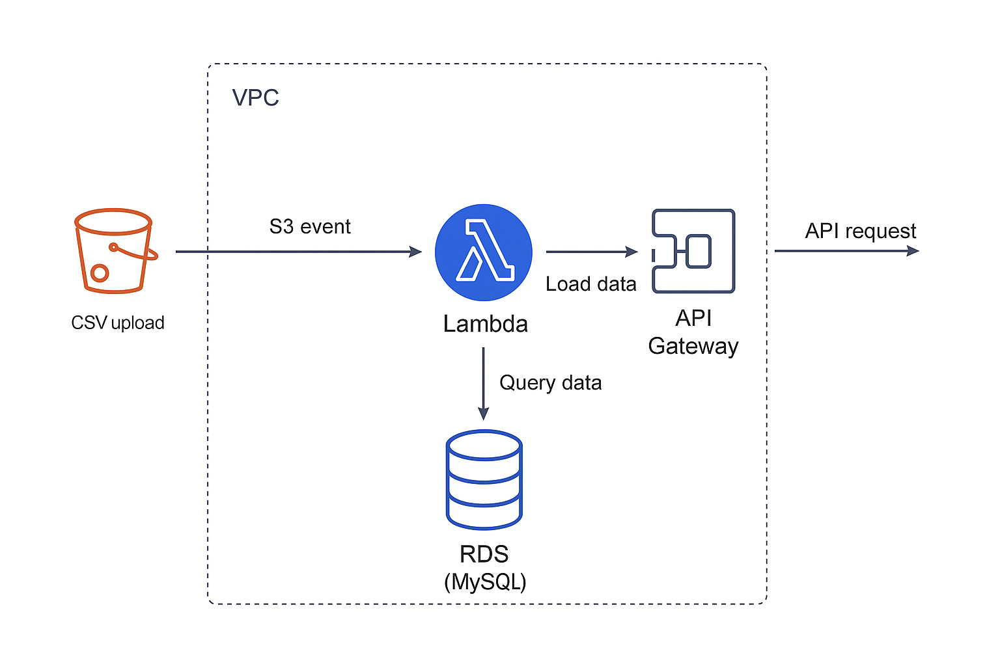

# Flight Data Terraform Challenge

This project deploys a serverless application using AWS Lambda, API Gateway, RDS, S3, and VPC — fully managed with Terraform.

---

## Prerequisites

Before getting started, make sure you have the following installed:

- [Python 3](https://www.python.org/downloads/)
- [pip](https://pip.pypa.io/en/stable/installation/)
- [AWS CLI](https://docs.aws.amazon.com/cli/latest/userguide/getting-started-install.html)
- [Terraform](https://developer.hashicorp.com/terraform/tutorials/aws-get-started/install-cli)
- `zip` CLI tool

Additionally:
- **Configure an AWS CLI Profile** with your AWS credentials:

```bash
aws configure --profile your-profile-name
```

## Setup Instructions

1. **Edit `aws.tfvars`**

   Open the `aws.tfvars` file and update the following values:

   - `aws_profile` – your AWS CLI profile name you just created above
   - `aws_region` – your preferred AWS region
   - `state_bucket` – a unique S3 bucket name for Terraform state (must be globally unique)
   - `state_key` - your terraform state key (e.g. terraform.tfstate)

2. **Run the Startup Script**

   In your terminal, run:

   ```bash
   ./startup.sh
   ```

This will:
- Create your S3 Terraform state bucket
- Initialize and apply the Terraform configuration
- Build and deploy the application
- Upload the flight data file to your S3 bucket

Please wait — deployment can take several minutes.


After deployment, the API Gateway Invoke URL will be outputted to the console.
You can use this URL in your browser to retrieve summary flight data. Because the file is so large, it can take a couple minutes for everything to process and show up at the url.

## Architecture Diagram

Below is a high-level architecture diagram of the deployed AWS resources:



### Components:

- **S3 Bucket**: Stores the uploaded flight data file and Terraform state file.
- **Lambda Function**: Processes uploaded CSV files and writes to RDS.
- **API Gateway**: Provides an HTTP endpoint to access the flight summary.
- **RDS (MySQL)**: Stores processed flight data and summary information.
- **VPC**: Provides network isolation for Lambda and RDS.

---

## Destroying Resources
To clean up all AWS resources created by this project:

   In your terminal, run:

   ```bash
   ./destroy.sh
   ```
This script will:
- Destroy all Terraform-managed infrastructure.
- Take a while to destroy everything. 

📄 Notes
- Ensure your AWS user has permissions to create and delete VPCs, Lambda functions, S3 buckets, and RDS instances.

- Some deletion operations (like VPCs, ENIs, and Security Groups) might take extra time to complete.